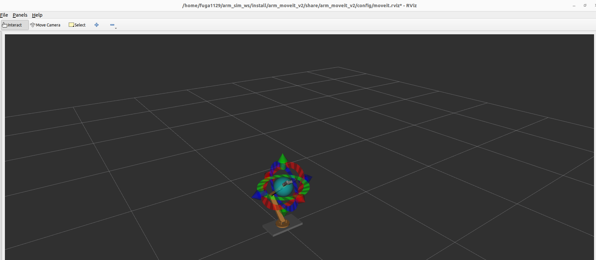

# パッケージ説明

moveitを使用するためのパッケージ<br>
 
## 使い方
1. ワーキングスペースに移動
```
cd ~/arm_sim_ws
colcon build
source install/setup.bash
```
2. launch ファイルを起動
```
ros2 launch arm_moveit_v3 demo.launch.py
```
rviz2でアームのモデルなどが出てこればok<br>
<br>
こんな感じの画面が出ればok
